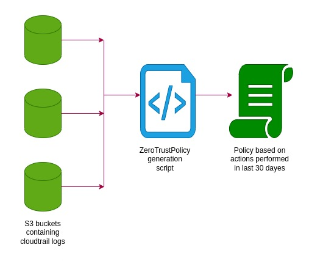

## AWS Zero Trust policy by CloudDefenseAI

The AWS Policy Generator API is a FastAPI application that helps you generate AWS IAM policies based on AWS CloudTrail logs. The API accepts a JSON payload containing the required AWS credentials, regions, and other relevant information, and then runs the policy generation process. Upon successful completion, it returns the time taken to generate the policies.



## Prerequisites

Before you begin, make sure you have the following prerequisites in place:

To run the AWS Policy Generator API, you need:

1. Python 3.6 or higher
2. FastAPI and Uvicorn packages installed
3. redis server

## Installation

To install and use the extended rule set for Falco runtime security, follow these steps:

1. Clone the Repository: Start by cloning this GitHub repository to your local system:

```
git clone https://github.com/CloudDefenseAI/AWSZeroTrustPolicy
```

2. Navigate to the Repository: Change to the repository directory:

```
cd AWSZeroTrustPolicy
```

3. install python libraries

```
pip install -r requirements.txt
```

## Usage

1. Run Redis server
   `redis-server`

2. Run the uvicorn application
   `uvicorn app:app --reload --host 0.0.0.0 --log-level debug`

3. Send the following curl request to generate the zerotrust policy

```
curl -X POST -H "Content-Type: application/json" -d '{
    "accountType": "Credential",
    "accessKey": "accessKey",
    "secretKey": "secretKey",
    "externalId": "externalId",
    "roleArn": "roleArn",
    "accountId": "accountId",
    "days": 30,
    "bucketData": {
        "us-east-1": "aws-cloudtrail-logs-bucketid"
    }
}' http://localhost:8000/run
```

## Contributing

If you want to help and wish to contribute, please review our contribution guidelines. Code contributions are always encouraged and welcome!

## License

This project is released under the [Apache-2.0 License](<[url](https://github.com/CloudDefenseAI/AWSZeroTrustPolicy/blob/master/LICENSE)>).

## Disclaimer:

The content and code available in this GitHub repository are currently a work in progress. Please note that the rules, guidelines, or any other materials provided here are subject to change without prior notice.
While we aim to ensure the accuracy and completeness of the information presented, there may be errors or omissions. We kindly request users to exercise caution and critical judgment when utilizing or relying on any content found in this repository.
We appreciate your understanding and patience as we continue to develop and refine the content within this repository. Contributions, feedback, and suggestions are welcome and greatly valued, as they contribute to the ongoing improvement of this project.
